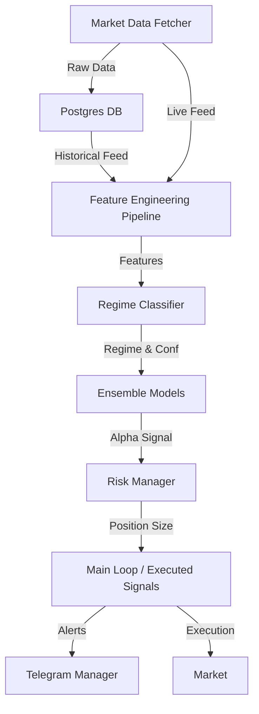

# System Architecture

The Options Intelligence Engine is a modular quant trading infrastructure designed for intraday NIFTY/BANKNIFTY derivatives.

## High-Level Components

### 1. Data Layer (`src/data`)
- **MarketFetcher**: Asynchronous Groww API client with automated retries.
- **Database**: PostgreSQL schema for snapshots, audit logs, and backtest results.
- **NSE Loader**: Tools for importing reference bhavcopy data.

### 2. Feature Layer (`src/features`)
- **Institutional Engine**: Computes IV, Greeks, GEX, and Trap scores.
- **Lag Safety**: Enforces strict non-leakage by lagging all features used for prediction.

### 3. Model Layer (`src/models`)
- **RegimeEnsemble**: A multi-regime switching architecture that selects specialized LightGBM models.
- **Registry**: Versioned model storage with `metadata.json` for reproducibility.

### 4. Strategy Layer (`src/strategy`)
- **RegimeClassifier**: Dynamic HMM or volatility-based regime detection.
- **RiskManager**: Kelly-based position sizing with hard risk caps and daily loss guards.

### 5. Monitoring Layer (`src/monitoring`)
- **DriftController**: Monitors feature and performance drift, adjusting trade sizes or pausing the engine if stability degrades.
